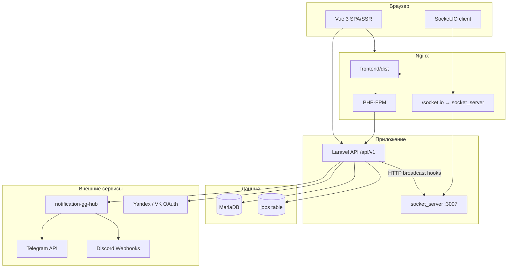

# 2. Архитектура

## Общая схема



## Компоненты

| Компонент | Путь | Роль |
|-----------|------|------|
| **Backend** | `backend/` | REST API, авторизация, бизнес-логика (DDD), очереди, планировщик |
| **Frontend** | `frontend/` | UI, SSR, маршрутизация, состояние (Pinia) |
| **Socket server** | `socket_server/` | Realtime: рейды, уведомления, опросы, календарь, рулетка |
| **Notification hub** | отдельный репозиторий | Прокси в Telegram/Discord с ingress-токеном |
| **Docker** | `docker-compose.yml`, `_docker/` | Оркестрация сервисов |

## Backend: Domain-Driven Design

Доменная логика в `backend/Domains/<Domain>/`:

- **Models** — Eloquent-сущности домена
- **Actions** — сценарии с `__invoke()` (use cases)
- **Enums, Rules, Exceptions** — по необходимости

HTTP-слой **не содержит бизнес-логики**:

```
Request → Controller → Action → Model/Repository → Resource → JSON
```

Валидация — в `FormRequest` с `messages()` и `attributes()` на русском.  
Ответы API — через `JsonResource`.

Репозитории (опционально для выборок):

- Интерфейсы: `app/Contracts/Repositories/`
- Реализации: `app/Repositories/Eloquent/`

## Frontend: Feature-Sliced Design

Слои (импорт только «вниз»):

```
app → pages → widgets → features → entities → shared
```

| Слой | Назначение |
|------|------------|
| `app/` | Layouts, провайдеры приложения |
| `pages/` | Страницы маршрутов Vue Router |
| `widgets/` | Крупные составные блоки UI |
| `features/` | Сценарии пользователя + composables |
| `entities/` | Сущности предметной области (карточки) |
| `shared/` | UI-kit, API-клиент, утилиты |

Вне FSD в `src/`: `router/`, `stores/`, `ssr/`.

## Авторизация и мультидоменность

- API использует **сессионные cookie** (Fortify), не Bearer JWT для основного фронта
- `SESSION_DOMAIN` — общий для `gg-hub.ru` и `admin.gg-hub.ru`
- Админские API: middleware `admin.subdomain` + permission `admnistrirovanie`
- Гильдейские API: `guild.member` + `guild.role.permission:<slug>`

## Очереди и планировщик

В контейнере `gg-php_8.4` параллельно:

1. `php artisan queue:work` — фоновые задачи (уведомления и др.)
2. `php artisan schedule:work` — cron-задачи (например Discord-напоминания о событиях)
3. `php-fpm` — HTTP

`QUEUE_CONNECTION=database`, `CACHE_STORE=database`, `SESSION_DRIVER=database`.

## Realtime-паттерн

Laravel после изменения данных вызывает **HTTP POST** на `socket_server` (broadcast hooks).  
Клиенты подписаны на комнаты Socket.IO и получают события без polling.

Подробнее: [07-realtime.md](07-realtime.md).

## Связанные документы

- [04-backend.md](04-backend.md) — домены и соглашения
- [05-frontend.md](05-frontend.md) — FSD и маршруты
- [06-api.md](06-api.md) — контракт API
