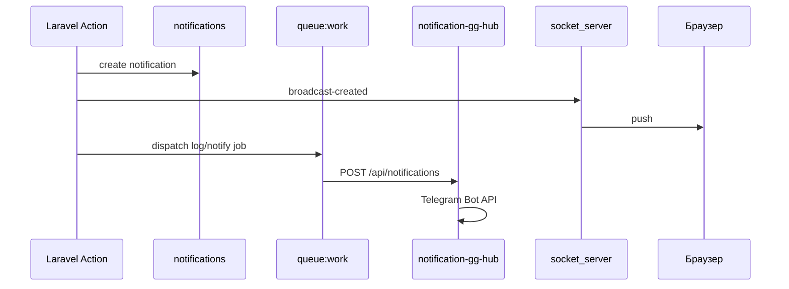

# 8. Уведомления

## Каналы доставки

| Канал | Механизм | Когда используется |
|-------|----------|-------------------|
| **In-app** | Таблица `notifications` + Socket.IO | Всегда при создании уведомления |
| **Telegram** | notification-gg-hub → Bot API | Если настроен hub / прямой канал |
| **Discord** | notification-gg-hub → webhook гильдии | События календаря, настройки гильдии |
| **Email** | Laravel Mail | Верификация, сброс пароля |

## In-app уведомления

### Модель

`app/Models/Notification` — поля включают тип, текст, ссылку (`link`), прочитанность.

### API

| Метод | Путь |
|-------|------|
| GET | `/api/v1/notifications` |
| PATCH | `/api/v1/notifications/{id}/read` |
| DELETE | `/api/v1/notifications/{id}` |
| DELETE | `/api/v1/notifications` (массовое) |

### Realtime

После изменений Laravel вызывает socket_server:

- `POST /notifications/broadcast-created`
- `POST /notifications/broadcast-read`
- `POST /notifications/broadcast-deleted`

Клиент: drawer в `widgets/header/NotificationsDrawer.vue`.

## notification-gg-hub

Отдельный репозиторий: `/home/ksv180384/projects/notification-gg-hub`.

**Назначение:** принимать HTTP от gg-backend и пересылать в Telegram или Discord без хранения контента на стороне hub (прокси).

### Эндпоинты hub

| Метод | Путь | Назначение |
|-------|------|------------|
| POST | `/api/notifications` | Сообщение в Telegram |
| POST | `/api/discord` | Сообщение в Discord webhook |

### Безопасность ingress

- Заголовок `X-Notification-Hub-Token` = `NOTIFICATION_HUB_INGRESS_TOKEN`
- Опционально: `NOTIFICATION_HUB_ALLOWED_IPS` (allowlist)

### Переменные gg-backend

```env
NOTIFICATIONS_LOG_CHANNEL=notification-hub
NOTIFICATION_HUB_URL=https://notification-gg-hub.ru
NOTIFICATION_HUB_INGRESS_TOKEN=...
# NOTIFICATION_HUB_TIMEOUT=10
```

Прямой Telegram (без hub):

```env
NOTIFICATIONS_LOG_CHANNEL=telegram
TELEGRAM_LOGGER_TOKEN=...
TELEGRAM_LOGGER_CHAT_ID=...
```

Канал настраивается в `config/logging.php`.

### Переменные notification-gg-hub (`src/.env`)

```env
TELEGRAM_LOGGER_TOKEN=
TELEGRAM_LOGGER_CHAT_ID=
NOTIFICATION_HUB_INGRESS_TOKEN=
NOTIFICATION_HUB_ALLOWED_IPS=
```

### Пример запроса

```bash
curl -X POST "https://notification-gg-hub.ru/api/notifications" \
  -H "X-Notification-Hub-Token: <token>" \
  -H "Content-Type: application/json" \
  -d '{"message":"Текст уведомления"}'
```

## Discord

Backend передаёт hub URL webhook гильдии и текст; hub выполняет POST на Discord.  
Используется для напоминаний о старте событий (`schedule:work` + команда в `routes/console.php`).

В настройках гильдии задаётся Discord webhook URL.

Аукцион использует те же Discord-настройки гильдии. Для него есть отдельные галочки:

- `Выставление лота на аукцион`;
- `Закрытие лота`.

Подробности: [guild-auction.md](guild-auction.md#уведомления).

## Email

- Верификация: `routes/web.php` → signed URL
- Fortify: регистрация, сброс пароля
- Dev: `MAIL_MAILER=log` → `storage/logs/laravel.log`
- Prod: SMTP через docker-mailserver

## Ссылки в уведомлениях

`FRONTEND_URL` (или `APP_URL`) — база для ссылок на страницы gg-hub в Telegram/письмах.

## Схема потока (in-app + Telegram)



## Связанные документы

- [07-realtime.md](07-realtime.md)
- [03-infrastruktura.md](03-infrastruktura.md) — почта
- README notification-gg-hub в соседнем репозитории
